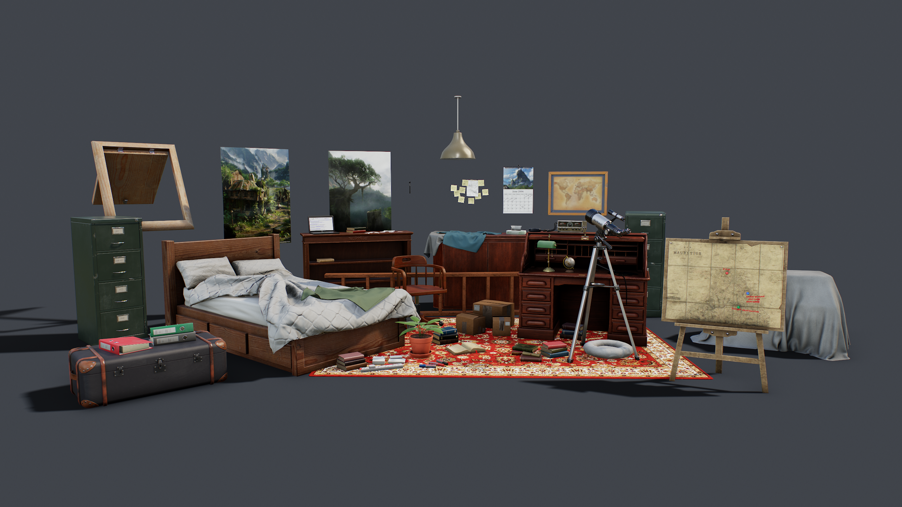
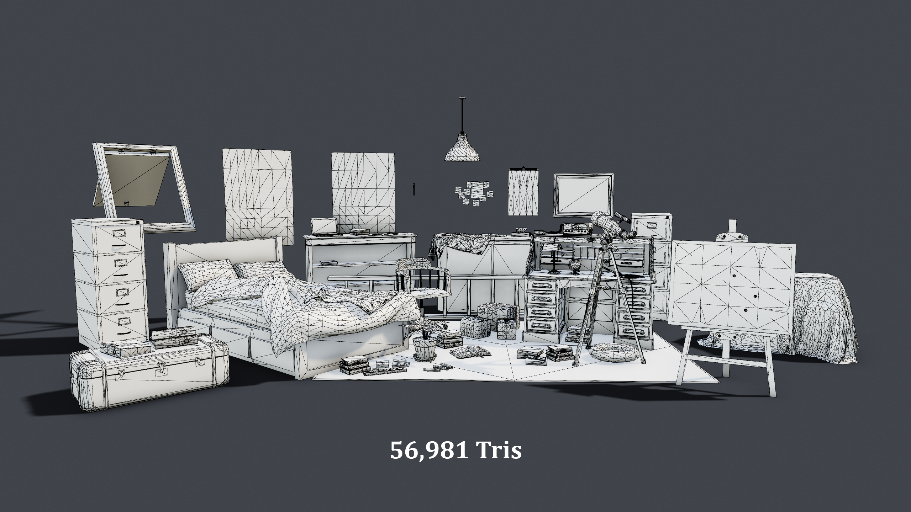
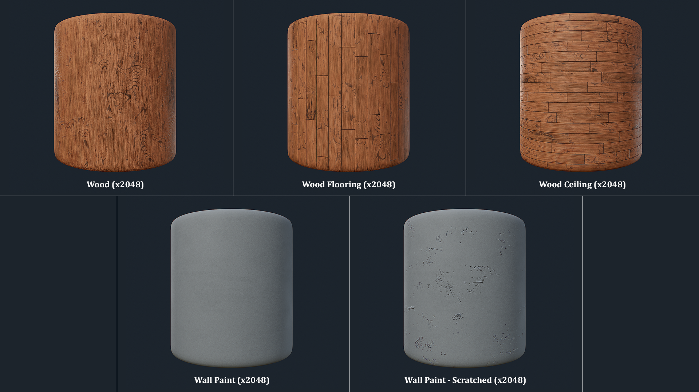
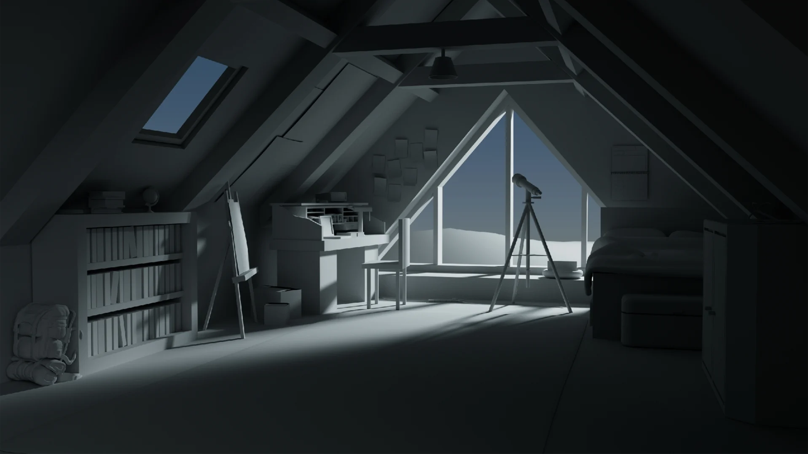

import ImageModal from "@components/ImageModal.astro";
export const components = { img: ImageModal };

A project done to learn about creating environments for games.
The aim was to create a warm feeling room that felt lived in. Thanks for viewing!

